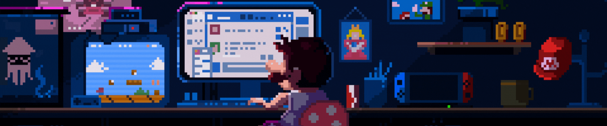

<h1 align="center">
    
<h3 align="center">  Uncovering Insights Through Magic of Data: I am Analyst and Data Scientist from India  </h3>
</h1>

  
 

    
- 🔭 I’m currently working on **Logistic Regression**

- 🌱 I’m currently learning **Machine Learning, Power BI, R**

- 💬 Ask me about **Python, Databases...or anything [here.](https://github.com/realshubhamraut/realshubhamraut/issues)**

- 💻 I proficiently use MacOS, Windows and LinuxOS Systems.
  
- 👨🏻‍💻 with **MacBook Air** as my primary computing device.

- ⚡ Random Thought - **"AI is the new OIL of 21st Century."**

- ⚡ Fun fact - My Typing Speed exceeds **120 WPM**.
 

 
 

 
  
  
  

 

 
<h1 align="center">   I can work with   </h1>
 

### Languagues: 👨‍💻
&nbsp;
&nbsp;
&nbsp;

### Libraries: 📚
&nbsp;
&nbsp;
&nbsp;
&nbsp;
&nbsp;
&nbsp;
&nbsp;
&nbsp;

### Databases: 💿
&nbsp;
&nbsp;
&nbsp;

### Tools: ⚙️
&nbsp;
&nbsp;
&nbsp;
&nbsp;
&nbsp;
&nbsp;
&nbsp;
&nbsp;
&nbsp;
&nbsp;
&nbsp;
&nbsp;

### Cloud Platforms: ☁
&nbsp;
&nbsp;
&nbsp;

 

<h2 align="center">  GitHub Stats </h2>

  

 

  <h2> ㅤPython is Eating my Contributionsㅤ</h2>
  

<h3 align="left">Connect with me: 
</h3>

<h3 align="center">
    
</h3>

